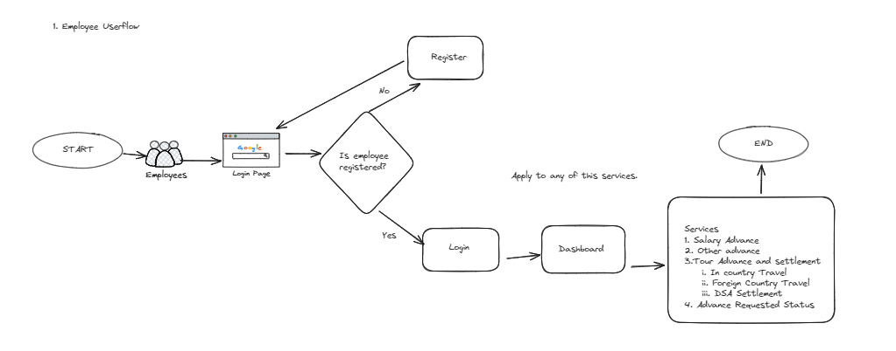
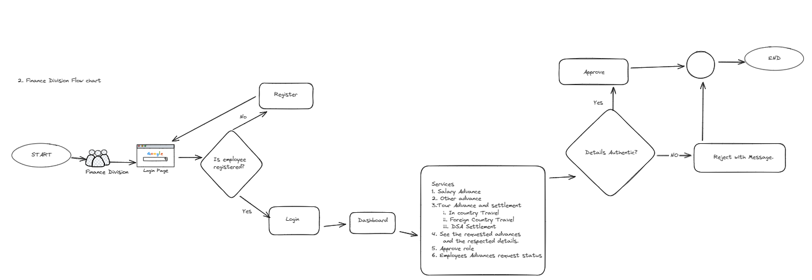
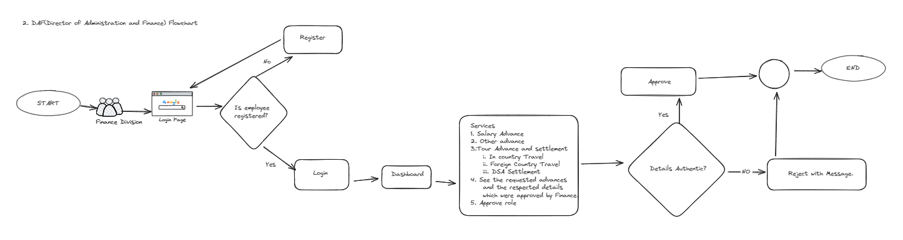

# ASA-Backend

## Introduction

The ASA-Backend project is a comprehensive backend system designed to manage and streamline the process of requesting and processing salary advances and other financial requests within an organization. Employees can submit forms for various types of advances, including Salary Advance, Medical Advance, Study Advance, Official Advance, and Tour Advance. Additionally, the system supports DSA (Daily Subsistence Allowance) claims related to Tour Advances, ensuring that employees can efficiently manage their financial needs while on official tours. This project aims to provide a seamless and user-friendly interface for handling advance requests, reducing administrative overhead, and improving overall operational efficiency.

## Key Features

- **Salary Advance:** Allows employees to request an advance on their salary.
- **Medical Advance:** Enables employees to request an advance for medical expenses.
- **Study Advance:** Provides employees with the option to request an advance for educational purposes.
- **Official Advance:** Supports employees in requesting advances for official purposes.
- **Tour Advance:** Facilitates advance requests for expenses related to official tours.
- **DSA Claim:** Supports employees in claiming Daily Subsistence Allowance related to Tour Advances.
- **Portal Notifications:** Whenever new advance has been submitted, Finance and Admin will be notified for processing the advance.
- **Email Notifications:** Similarly Portal Notification is configured.

## ASA-Backend Setup Guide

### Prerequisites

Before setting up the ASA-Backend, ensure you have the following installed:

- **Ruby** 
- **Rails** 
- **MySQL** 
- **Bundler** 
- **Git** 

### Step 1: Clone the Repository

Clone the ASA-Backend repository to your local machine:

```bash
git clone git@github.com:PrimeRin/asa-backend.git
cd asa-backend
```

### Step 2: Install Dependencies
Use Bundler to install the required Ruby gems:
```bash
bundle install
```

### Step 3: Database Setup
```bash
rails db:create
rails db:migrate
rails db:seed
```

### Step 4: Create env file
 - create env file
 - add all env variables

 ### Step 5: Start the Server
 Once everything is set up, start the Rails server:
 ```bash
 rails s
```

## User flow diagram





## Advance flow diagram


Employee submits the advance request form with advance amounts and details which is initially kept in pending state. Finance teams checks the pending advances and it verifies or reject a/c to the details. If the advance is verified then it is forwared to the DAF Director for the confirmation, once the advance is confirmed Finance dispatches the fund to the requestors account.


## Non-Functional Requirements

1. Faster Processing: Digital systems can automate workflows, reducing the time it takes to review, approve, and process advances.
2. Automated Calculations: Digital systems can perform calculations automatically, minimising the risk of errors in calculating advance amounts, interest, or repayments.
3. Data Validation: Automated validation checks can ensure that all required information is provided, reducing the likelihood of incomplete or inaccurate submissions 
4. Paperless Operation: Going digital eliminates the need for physical paperwork, reducing costs associated with printing, storage, and transportation 
5. Anytime, Anywhere Access: Digital systems enable users to submit requests and access information from anywhere with an internet connection, promoting flexibility and convenience. 
6. Seamless Integration: Digital systems can integrate with other organisational software, such as HR or ICBS, streamlining data flow and reducing the need for manual data entry. 

We anticipate that the implementation of this digital platform will not only improve the speed and accuracy of approval processes but also contribute to a more streamlined and accountable advance management system. 
